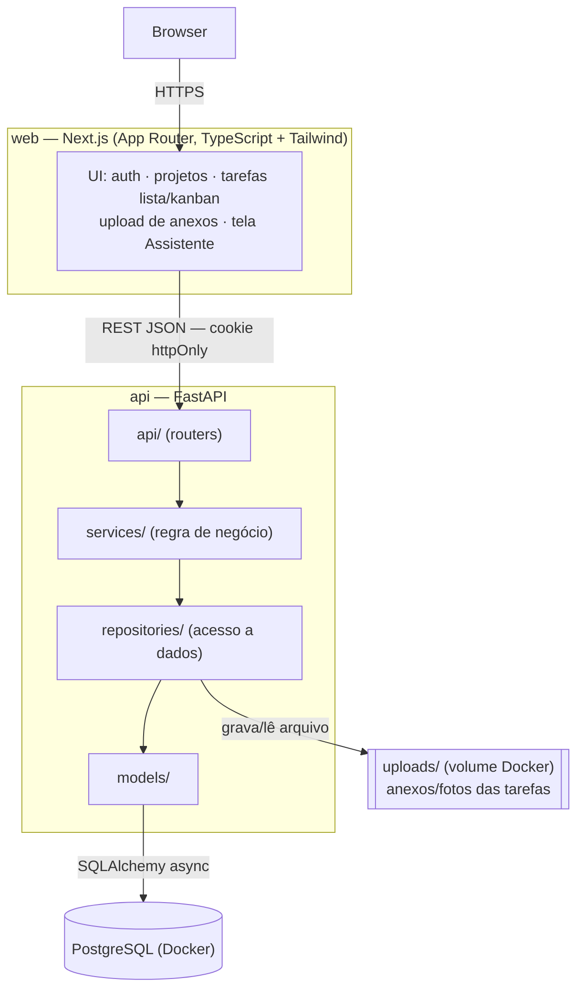
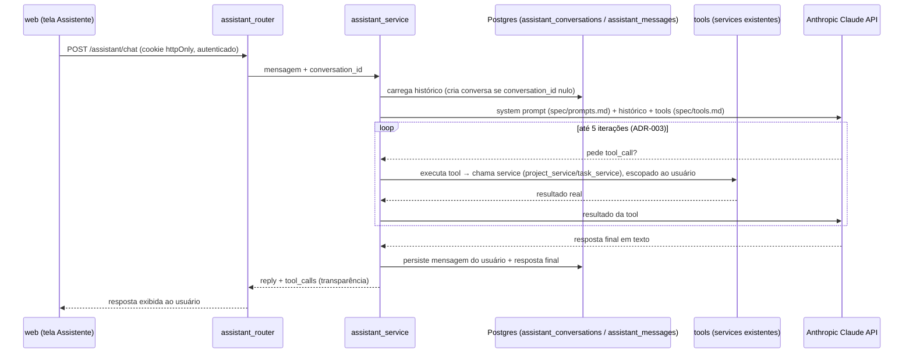

## System Overview



**Assistente (extensão, além do escopo mínimo)** — roda **dentro do mesmo processo/contexto da API**, não é um servidor separado. Histórico persistido em Postgres (`ADR-003`), loop de tool use limitado a 5 iterações:



## Components

| Component | Responsibility |
|---|---|
| `web` (Next.js) | UI: autenticação, projetos, tarefas em lista/kanban, upload de anexos, tela "Assistente" (chat). Consome a API via REST. |
| `api` (FastAPI) | Autenticação, regras de negócio, persistência, upload/serving de anexos, orquestração do assistente. Fonte única da verdade dos dados. |
| PostgreSQL | Armazena usuários, projetos, tarefas, anexos (metadados). |
| Volume `uploads/` | Armazena os arquivos de anexo/foto em disco (dev); ponto de troca futuro para storage de objeto (S3-compatible). |
| `assistant` (extensão, dentro de `api`) | Endpoint de chat (`/assistant/chat`) que usa Claude (tool use) para interpretar linguagem natural e acionar `list_projects`, `list_tasks`, `create_task`, `update_task_status` — sempre escopado ao usuário autenticado da requisição, sem usuário fixo/token separado. Ver `spec/tools.md`, `spec/prompts.md` e `ADR-003`. |

## Data Flow

1. Usuário se cadastra/loga em `web` → `POST /api/v1/auth/register` ou `/login` → API valida credenciais, define cookie `httpOnly` com JWT.
2. Toda chamada subsequente do `web` para a `api` inclui o cookie automaticamente (`credentials: "include"`); a API decodifica o JWT numa dependency (`get_current_user`) e injeta o usuário autenticado no handler.
3. CRUD de projetos e tarefas segue `router → service → repository → PostgreSQL`, sempre escopado ao `user_id` do usuário autenticado (nunca um usuário acessa dado de outro).
4. Upload de anexo: `web` envia `multipart/form-data` → API grava o arquivo em `uploads/{task_id}/{filename}` e persiste metadados (nome, tipo, tamanho, path) vinculados à `Task`.
5. `web` alterna lista/kanban localmente (estado de UI) a partir dos mesmos dados retornados por `GET /projects/{id}/tasks` — não há endpoint separado por modo de visualização. Mudança de status no kanban é feita por um controle explícito no card (dropdown/botão), chamando `PATCH /tasks/{id}` — sem drag-and-drop, sem campo de posição (ver `ADR-004`).
6. **Assistente (extensão):** usuário abre a tela "Assistente" em `web` e envia uma mensagem → `POST /api/v1/assistant/chat` (mesmo cookie/autenticação de sempre). O `assistant_service` carrega o histórico da conversa (`assistant_conversations`/`assistant_messages`, criando a conversa se `conversation_id` vier nulo), monta o system prompt (`spec/prompts.md`) + histórico + as 4 tools (`spec/tools.md`) e chama a API da Anthropic. Se o modelo pedir uma tool, o `assistant_service` executa a função Python correspondente — que chama o `service` já existente (`project_service`/`task_service`), escopado ao `user_id` da requisição, exatamente como um router REST faria — devolve o resultado ao modelo, e repete (até 5 iterações, ver `ADR-003`) até haver uma resposta final em texto. A mensagem do usuário e a resposta final são persistidas em `assistant_messages` antes de responder.

## Technology Decisions

| Decision | Choice | Reason |
|---|---|---|
| Backend framework | FastAPI | Async nativo, validação via Pydantic, OpenAPI automático — útil para o vídeo de demonstração e para testar endpoints manualmente. |
| ORM | SQLAlchemy 2.0 (async) + Alembic | Maduro, tipagem forte, migrations versionadas — necessário mesmo em projeto curto para não perder histórico do schema. |
| Validação/schemas | Pydantic v2 | Nativo do FastAPI, elimina camada extra de serialização manual. |
| Autenticação | JWT em cookie `httpOnly` + `passlib[bcrypt]` | Ver `ADR-001`. Sessão persistente sem expor o token a XSS via `localStorage`. |
| Frontend framework | Next.js 14+ (App Router, TypeScript) | Decisão já tomada pelo usuário; App Router simplifica layout de rotas autenticadas vs públicas. |
| Data fetching (frontend) | TanStack Query | Cache, loading/error state e revalidação prontos para uma UI CRUD-heavy, sem reinventar isso manualmente. |
| Estilo (frontend) | Tailwind CSS | Velocidade de construção de UI própria e polida dentro de 3 dias — o case avalia identidade visual. |
| Banco de dados | PostgreSQL 16 (Docker) | Requisito obrigatório da vaga; decisão do usuário de rodar via Docker. |
| Armazenamento de anexos | Disco local (volume Docker) em dev | Simplicidade dentro do prazo; ver "Improvement Suggestions" em `spec/product.md` para troca futura por storage de objeto. |
| Tags da tarefa | Coluna `text[]` (array nativo do Postgres) na própria `Task` | Ver `ADR-002`. |
| Testes | pytest + pytest-asyncio + `httpx.AsyncClient` | Diferencial priorizado pelo usuário; testa os endpoints reais contra um Postgres efêmero, sem mockar o banco. |
| CI/CD | GitHub Actions (lint + testes + build) | Diferencial priorizado pelo usuário. |
| Deploy | Não configurado por padrão — local-first (`docker-compose`) | Decisão do usuário: deploy é opcional ("se possível" no case) e só é perseguido se sobrar tempo. |
| Assistente (LLM) | Anthropic Claude API (`anthropic` SDK, tool use) | Alinhado à stack de IA valorizada pela vaga; roda no mesmo processo da API — sem servidor MCP externo por enquanto. Ver `ADR-003`. |
| Anti-alucinação do assistente | System prompt restritivo + tools como única fonte de dados (`spec/prompts.md`) | O modelo nunca deve responder sobre tarefas/projetos sem antes chamar uma tool — ver regras detalhadas em `spec/prompts.md`. |
| Histórico de conversa do assistente | Persistido em Postgres (`assistant_conversations` + `assistant_messages`), não em memória do processo | Ver `ADR-003` (nota de complemento). Memória de processo não sobrevive a restart nem garante consistência entre múltiplos workers. |
| Limite de iterações do loop de tool use | Máx. 5 tool calls por mensagem no `assistant_service` | Ver `ADR-003` (nota de complemento). Proteção barata contra loop/custo descontrolado de chamadas à API da Anthropic. |

## Project Structure

```
TestUEX/
├── spec/                        # specs SDD (este pipeline)
├── api/                         # backend FastAPI
│   ├── app/
│   │   ├── main.py              # cria a app, registra routers e middlewares
│   │   ├── config.py            # Settings (pydantic-settings), lê variáveis de ambiente
│   │   ├── api/
│   │   │   ├── deps.py          # get_db, get_current_user
│   │   │   └── v1/
│   │   │       ├── auth_router.py
│   │   │       ├── projects_router.py
│   │   │       ├── tasks_router.py
│   │   │       ├── attachments_router.py
│   │   │       └── assistant_router.py       # POST /assistant/chat (extensão)
│   │   ├── services/
│   │   │   ├── auth_service.py
│   │   │   ├── project_service.py
│   │   │   ├── task_service.py
│   │   │   ├── attachment_service.py
│   │   │   └── assistant_service.py          # orquestra Claude + tools + histórico
│   │   ├── assistant/                        # extensão — isolada do core do produto
│   │   │   ├── system_prompt.py              # espelha spec/prompts.md
│   │   │   └── tools/
│   │   │       ├── list_projects.py
│   │   │       ├── list_tasks.py
│   │   │       ├── create_task.py
│   │   │       └── update_task_status.py
│   │   ├── repositories/
│   │   │   ├── user_repository.py
│   │   │   ├── project_repository.py
│   │   │   ├── task_repository.py
│   │   │   ├── attachment_repository.py
│   │   │   └── assistant_conversation_repository.py    # histórico de chat (ADR-003)
│   │   ├── models/
│   │   │   ├── user.py
│   │   │   ├── project.py
│   │   │   ├── task.py
│   │   │   ├── attachment.py
│   │   │   ├── assistant_conversation.py
│   │   │   └── assistant_message.py
│   │   ├── schemas/
│   │   │   ├── auth_schema.py
│   │   │   ├── project_schema.py
│   │   │   ├── task_schema.py
│   │   │   ├── attachment_schema.py
│   │   │   └── assistant_schema.py
│   │   ├── exceptions/
│   │   │   └── domain_exceptions.py   # NotFoundError, ForbiddenError, etc.
│   │   └── utils/
│   │       └── security.py            # hash_password, verify_password, create_jwt, decode_jwt
│   ├── alembic/
│   │   ├── versions/
│   │   └── env.py
│   ├── tests/
│   │   ├── conftest.py                # app de teste + Postgres efêmero + client autenticado
│   │   ├── test_auth.py
│   │   ├── test_projects.py
│   │   ├── test_tasks.py
│   │   ├── test_attachments.py
│   │   └── test_assistant.py          # tools testadas isoladas (sem chamar a API da Anthropic de verdade)
│   ├── uploads/                       # volume de anexos (gitignored)
│   ├── Dockerfile
│   ├── requirements.txt
│   └── alembic.ini
├── web/                          # frontend Next.js
│   ├── app/
│   │   ├── (auth)/
│   │   │   ├── login/page.tsx
│   │   │   └── register/page.tsx
│   │   ├── (app)/
│   │   │   └── projects/
│   │   │       ├── page.tsx              # lista de projetos
│   │   │       └── [projectId]/page.tsx  # lista/kanban de tarefas
│   │   └── layout.tsx
│   ├── components/
│   │   ├── kanban/
│   │   ├── task-list/
│   │   ├── task-form/
│   │   └── ui/
│   ├── lib/
│   │   ├── api-client.ts        # wrapper fetch com credentials: "include"
│   │   └── types.ts             # tipos espelhando spec/data-model.md
│   ├── Dockerfile
│   └── package.json
├── docker-compose.yml            # api + postgres (web roda via `npm run dev` em dev)
├── .github/workflows/ci.yml      # lint + pytest + build de api e web
└── README.md
```

## Patterns & Conventions

- **Layered backend**: `api` (routers) → `services` (regra de negócio) → `repositories` (acesso a dados) → `models`. `api` nunca importa `repositories` diretamente; `repositories` nunca conhece `services` ou `api` (ver `python-architecture-standards.md`).
- **Autorização por escopo de usuário**: todo repository de `Project`/`Task` recebe `user_id` como filtro obrigatório — nunca uma query genérica sem esse filtro. Acesso a recurso de outro usuário retorna `404` (não `403`, para não vazar existência do recurso).
- **Exceções de domínio**: `ProjectNotFoundError`, `TaskNotFoundError`, `InvalidCredentialsError`, etc. — levantadas nos `services`, convertidas em `HTTPException` apenas na camada `api` (nunca deixar exceção do SQLAlchemy vazar para a resposta).
- **Dependency Injection**: repositories recebem a sessão do banco via `Depends(get_db)`; services recebem repositories no construtor — nunca instanciados hardcoded dentro de um router.
- **Migrations**: toda alteração de schema passa por uma revision do Alembic — nunca alterar tabela manualmente no banco de dev.
- **Testes**: cada endpoint tem ao menos um teste de caminho feliz e um de erro (401/404/400) relevante; testes rodam contra um Postgres real (via docker-compose no CI), não SQLite, para refletir comportamento real de `text[]` e constraints.
- **Registro de prompts de IA**: toda vez que um trecho relevante de código for gerado com assistência de IA, registrar o prompt em `spec/prompts.md` (ver seção dedicada) — não deixar para reconstituir no fim.

## Risks

- **Prazo de 3 dias com stack de 2 linguagens (Python + TypeScript)**: risco de gastar tempo demais alternando contexto. Mitigação: fechar `spec/api.md` e `spec/data-model.md` antes de escrever qualquer código, para que back e frontend avancem em paralelo sem retrabalho de contrato.
- **Upload de anexos em disco local**: não sobrevive a um redeploy em plataformas com filesystem efêmero (ex: Railway/Render sem volume persistente). Mitigação: documentar essa limitação no README; só relevante se a opção de deploy real for perseguida.
- **JWT em cookie sem refresh token**: sessão expira e obriga novo login após o tempo de expiração do token. Mitigação aceita conscientemente — ver `ADR-001`, adequado ao escopo do case.
- **Alucinação do assistente**: o modelo pode inventar dados (ex: dizer que criou uma tarefa sem de fato chamar a tool). Mitigação: regras explícitas em `spec/prompts.md` proibindo resposta sobre dados sem tool call prévia, e a resposta final só é construída depois de todo tool call ser resolvido com o dado real do banco.
- **Custo/latência de API externa (Anthropic)**: cada mensagem do chat é uma chamada de API paga. Mitigação: usar um modelo mais leve/rápido (ex: Haiku) para esse caso de uso, já que as tools são simples e não exigem raciocínio complexo; loop de tool use limitado a 5 iterações por mensagem (ver `ADR-003`).
- **Histórico do assistente perdido entre requisições**: identificado na revisão de arquitetura — guardar o histórico só em memória do processo quebraria entre restarts/múltiplos workers. Mitigação: persistido em `assistant_conversations`/`assistant_messages` (ver `spec/data-model.md` e `ADR-003`).
